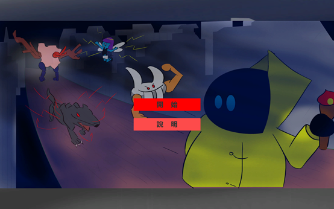
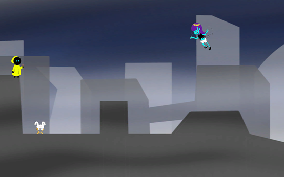

# Platformer2D

A 2D platformer project made with Unity for **Digital Gaming and Learning** in September 2021.

This repository contains the Windows playable build.

## Run

Run `Platformer2D.exe` on Windows to play.

## Controls

- Move: Left / Right Arrow
- Jump: Space

## Screenshots

